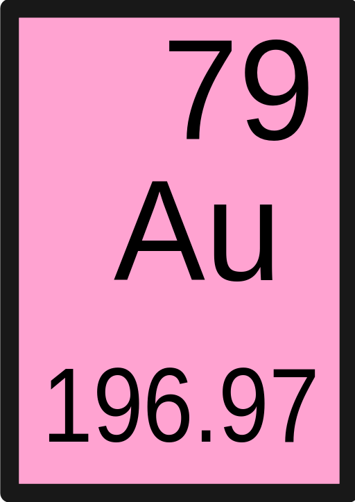

<div id="top"></div>
<!--
*** Thanks for checking out the Best-README-Template. If you have a suggestion
*** that would make this better, please fork the repo and create a pull request
*** or simply open an issue with the tag "enhancement".
*** Don't forget to give the project a star!
*** Thanks again! Now go create something AMAZING! :D
-->


<!-- PROJECT SHIELDS -->
<!--
*** I'm using markdown "reference style" links for readability.
*** Reference links are enclosed in brackets [ ] instead of parentheses ( ).
*** See the bottom of this document for the declaration of the reference variables
*** for contributors-url, forks-url, etc. This is an optional, concise syntax you may use.
*** https://www.markdownguide.org/basic-syntax/#reference-style-links
-->


<!-- PROJECT LOGO -->
<br />
<div align="center">
  <a href="#">
    
  </a>

  <h3 align="center">(Au)dio (Au)gmentation = auau</h3>

  <p align="center">
    It's all a work in progress since 2022-01-20
    <br />
  </p>
</div>


<!-- TABLE OF CONTENTS -->
<details>
  <summary>Table of Contents</summary>
  <ol>
    <li>
      <a href="#about-the-project">About The Project</a>
      <ul>
        <li><a href="#built-with">Built With</a></li>
      </ul>
    </li>
    <li>
      <a href="#getting-started">Getting Started</a>
      <ul>
        <li><a href="#prerequisites">Prerequisites</a></li>
        <li><a href="#installation">Installation</a></li>
      </ul>
    </li>
    <li><a href="#usage">Usage</a></li>
    <li><a href="#roadmap">Roadmap</a></li>
    <li><a href="#contributing">Contributing</a></li>
    <li><a href="#license">License</a></li>
    <li><a href="#contact">Contact</a></li>
    <li><a href="#acknowledgments">Acknowledgments</a></li>
  </ol>
</details>


<!-- ABOUT THE PROJECT -->
## About The Project

This library is mainly intended for experimenting with audio data augmentation.
Let's see what happen!

Simple tests on [Google Colab](https://colab.research.google.com/drive/1cGLf8GYRZ3oYWylMnLXIo5Muv7BaiUua?usp=sharing)

<p align="right">(<a href="#top">back to top</a>)</p>


### Built With

This library is built on top of the following open-source projects:

* [librosa](https://librosa.org/doc/latest/index.html)
* [soundfile](https://pysoundfile.readthedocs.io/en/latest/)
* [numpy](https://numpy.org/)
* [torchaudio](https://pytorch.org/audio/stable/index.html)
* [pytorch](https://pytorch.org/)

<p align="right">(<a href="#top">back to top</a>)</p>


<!-- GETTING STARTED -->
## Getting Started

To get started using `auau` you must have a python version `>=3.6`. Hereafter some considerations:
- `noise/` folder contains some examples from UrbanSound8K. They can be used as noise signals.
- `outputs/` folder is just an example containing some augmented audios.
- **You DO NOT require those folders for running the audio augmentations.**

### Prerequisites

The library is built on top of other audio augmentation libraries:
- librosa
- torch-audiomentations
- torchaudio

### Installation

_Install library in one command_


1. Execute the following on your preferred environment
   ```sh
   pip install git+https://github.com/MorenoLaQuatra/auau.git
   ```
2. That's it!

<p align="right">(<a href="#top">back to top</a>)</p>


<!-- USAGE EXAMPLES -->
## Usage

```python
from auau.augmenter import Augmenter
from auau.loader import Loader
import soundfile as sf
import librosa

au = Augmenter()
loader = Loader()

signal, sr = loader.load_file("resources/test_audio.wav")

# White noise
noise_factor = 0.25
augmented_signal = au.add_white_noise(signal, noise_factor=0.25)
loader.save_file(f"outputs/test_audio_noise-{noise_factor}.wav", augmented_signal, sr)

# Time Strech
time_stretch_rate = 1.4
augmented_signal = au.time_stretch(signal, time_stretch_rate=time_stretch_rate)
loader.save_file(f"outputs/test_audio_timestretch-{time_stretch_rate}.wav", augmented_signal, sr)

# Pitch Scale
num_semitones = 2
augmented_signal = au.pitch_scale(signal, sampling_rate=sr, num_semitones=num_semitones)
loader.save_file(f"outputs/test_audio_pitch-{num_semitones}.wav", augmented_signal, sr)

# Random Gain
augmented_signal = au.random_gain(signal, min_gain=1, max_gain=1.1)
loader.save_file(f"outputs/test_audio_random_gain.wav", augmented_signal, sr)

# Polarity
augmented_signal = au.invert_polarity(signal)
loader.save_file(f"outputs/test_audio_invert_polarity.wav", augmented_signal, sr)

# External noise
noise_signal, noise_sr = librosa.load("noise/7383-3-0-0.wav")
au.resample(noise_signal, source_sr = noise_sr, target_sr = sr)
augmented_signal = au.add_noise(signal, noise_signal, noise_factor=0.25)
loader.save_file(f"outputs/test_noise.wav", augmented_signal, sr)

# Multiple external noise
list_noise_signals = []
list_noise_factors = []

noise_signal, noise_sr = librosa.load("noise/7383-3-0-1.wav")
list_noise_signals.append(librosa.resample(noise_signal, noise_sr, sr))
list_noise_factors.append(0.1)

noise_signal, noise_sr = librosa.load("noise/14113-4-0-0.wav")
list_noise_signals.append(librosa.resample(noise_signal, noise_sr, sr))
list_noise_factors.append(0.15)

augmented_signal = au.add_multiple_noise(signal, list_noise_signals=list_noise_signals, list_noise_factors=list_noise_factors)
loader.save_file(f"outputs/test_multiple_noise.wav", augmented_signal, sr)


# Random noise from folder
augmented_signal = au.add_random_noise(signal, sr, noise_folder="./noise/", min_noise_factor=0.01, max_noise_factor=0.05)
loader.save_file(f"outputs/test_random_noise.wav", augmented_signal, sr)

# Low pass filter
augmented_signal = au.low_pass_filter(signal, sr)
loader.save_file(f"outputs/test_audio_lowpass.wav", augmented_signal, sr)

# High pass filter
augmented_signal = au.high_pass_filter(signal, sr)
loader.save_file(f"outputs/test_audio_highpass.wav", augmented_signal, sr)

```


<!-- ROADMAP -->
## Roadmap

Please propose something you want to see in this library

- [x] Initial release `0.0.1`!
- [x] Make it work on GPU (if available)
- [ ] Additional augmentations (e.g., distortion or voice morphing)
- [ ] Pipelines
- [ ] Implement real documentation (besides examples)
- [ ] Standard support for multichannel audio (mainly stereo)

See the [open issues](https://github.com/MorenoLaQuatra/auau/issues) for a full list of proposed features (and known issues).

<p align="right">(<a href="#top">back to top</a>)</p>


<!-- CONTRIBUTING -->
## Contributing

- **V0.0.2** - This library is unstable and intented just for experimentation purposes.

<p align="right">(<a href="#top">back to top</a>)</p>


<!-- LICENSE -->
## License

Distributed under the GNU General Public License v3.0 License. See `LICENSE` for more information.

<p align="right">(<a href="#top">back to top</a>)</p>


<!-- CONTACT -->
## Contact

Project Link: [https://github.com/MorenoLaQuatra/auau](https://github.com/MorenoLaQuatra/auau)

<p align="right">(<a href="#top">back to top</a>)</p>


<!-- ACKNOWLEDGMENTS -->
## Acknowledgments

* [Valerio Velardo](https://github.com/musikalkemist) - This library is mainly inspired by Valerio's work!
* [README template](https://github.com/othneildrew/Best-README-Template)
* [Logo image](https://commons.wikimedia.org/wiki/File:Gold.svg)

<p align="right">(<a href="#top">back to top</a>)</p>
